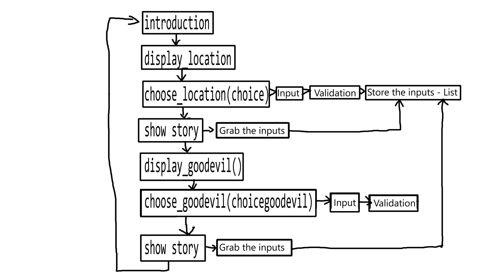
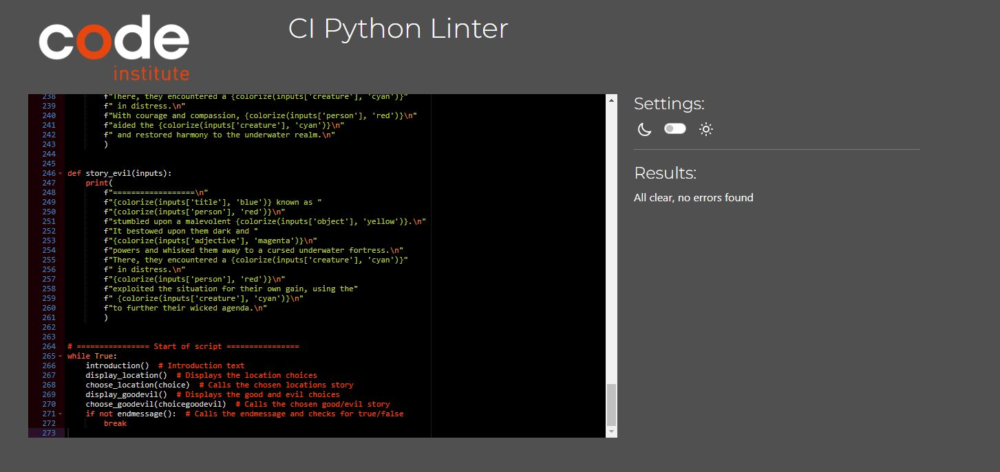

<h1>Madlibs Python</h1>
This is a Python portfolio-project.  
The application is designed to be a branching type of madlibs game. The application offers a clear and simple game with simple visuals to keep the player well informed and engaged.  

## Table of Contents

1.  

      
<a href="#goals">Goals</a>

    - [Visitor Goals](#visitor-goals)
    - [User Stories](#user-stories)

2.  

      
    
<a href="#features">Features</a>

    - [Flow-chart](#flow-chart)
    - [DataModel](#data-model)
    - [Validation](#validation)
    - [Introduction](#introduction)
    - [End-message](#end-message)
    - [Feature-ideas](#feature-ideas)

3.  

      
<a href="#technologies-used">Technologies Used</a>

    - [Languages](#languages)
    - [Platforms](#platforms)
    - [Other Tools](#other-tools)

    

4.  

      
<a href="#testing">Testing</a>

      <ul>
      <li>

      
<a href="#methods">Methods</a>

      
      - [Validation](#validation)
      - [General Testing](#general-testing)
      - [Mobile Testing](#mobile-testing)
      - [Desktop Testing](#desktop-testing)
      
</li>
      <li>

      
<a href="#bugs">Bugs</a>

    - [Known Bugs](#known-bugs)
    - [Fixed Bugs](#fixed-bugs)
    
</li>
    </ul>
    

5.  

      
<a href="#deployment">Deployment</a>

      <ul>
      <li>

      
<a href="#local-deployment">Local Deployment</a>

      
      - [Local Preparation](#local-preparation)
      - [Local Instructions](#local-instructions)
      
</li>
      <li>

      
<a href="#heroku-deployment">Heroku Deployment</a>

      
      - [Github Preparation](#github-preparation)
      - [Github Instructions](#github-instructions)
      
</li>
      </ul>
    

6.  

      
<a href="#credit-and-contact">Credit and Contact</a>

      
      - [Content](#content)
      - [Contact](#contact)
    

---

# Goals

### Visitor Goals

The target audience for Madlibs Pythonare:

- People who want to play a madlibs game.
- People who want to see branching stories.
- People who want create their own story.

User goals are:

- Getting a clear understanding of the game.
- Allow for users to shape their own story
- Be able to replay the game with a new story

Madlib Python fills these needs by:

- Clearly stating how the game is played
- Showing each branch of the story clearly
- Showing confirmation of each decision the player makes
- Displaying in colors what words the user has input to influence the story
- Allowing the user to easily replay the game again

### User Stories

1. As a user interested in making my own stories I want to be able to influence the outcome
2. As a user I'd like to see many different stories
3. I'd like for the game to not be confusing

---

# Features

## Flow-chart

## Data-Model

The user inputs data in a dictionary called inputs
The game later accesses those inputs to fill out the chosen story

The game uses a dictionary called colorise to store colors and
use them to color the users input words

The game uses a dictionary called word_list to describe to the player
what type of words they should be entering

## Validation

Each time the user sends an input the validator will check if it's a letter, or a number and if the number entered is in the list of choices being given

The validation has been manually tested and can be seen here

- [Manual Testing](#manual-testing)

## Branches

The game offers 3 different branches at the start

-forest
-desert
-ocean

It then offers 2 more branches of

-good
-evil

## Introduction

A brief introduction on what the game is about and explaining
how the users inputs changes the story and how there will be
different branches

## End-message

a message in the end asking if the player wants to play again or quit the game

## Feature-ideas

The introduction and end messages is to give the player a clear understanding of the game with as few words as possible

The Idea of the branching stories is to give the game more replayability

The user inputs are colorised to clearly show the player what their attribution to the story was

The validation helps to stop player confusion and from breaking the game

---

# Technologies Used

## Languages

- [Python]
  - Interactivity and styling.

## Platforms

- [Heroku](https://heroku.com/)
  - Deployment of the application(Terminal)
- [Github](https://github.com/)
  - Storing code remotely and deployment.
- [Gitpod](https://gitpod.io/)
  - IDE for project development.

## Other Tools

- [chat.gpt](https://chat.openai.com/)
  - Create the stories

---

# Testing

### Validation

Python code validated with CI linter (https://pep8ci.herokuapp.com/)
with no errors found

### General Testing

- Each time a feature was added, all the functions were tested to see if there was an impact.
- The site application was sent to friends for feedback and testing.
- .gitignore file has been included to prevent system file commits.

### Manual Testing

- Testing done through playing the game

|                         | input                | outcome                                       |
| ----------------------- | -------------------- | --------------------------------------------- |
| ask for letter          | letter               | Story continues                               |
| ask for letter          | input number         | "Invalid input. Please enter a valid letter." |
| ask for specific number | input correct number | Story continues                               |
| ask for specific number | input wrong number   | "Invalid input. Please enter a valid choice." |
| ask for specific number | input letter         | "Invalid input. Please enter a valid number." |

### Mobile Testing

- I tested the application personally on my Android device, going through the entire process
- The application was sent to friends and relatives for them to follow the same process. They have tested on their devices, including iOS.

### Desktop Testing

- the majority of testing occurred on vscode.
- The site was tested by friends and relatives on numerous desktop devices.

### Testing User Stories

|     |                                         User story                                         |                                                                                                                                                                                                                        Answer to user story |
| --- | :----------------------------------------------------------------------------------------: | ------------------------------------------------------------------------------------------------------------------------------------------------------------------------------------------------------------------------------------------: |
| 1   | "As a user interested in making my own stories I want to be able to influence the outcome" |                                                                                                                 The game supports inputs from the players and shows each word the player entered in a unique color to give visual feed-back |
| 2   |                     "As a user I'd like to see many different stories"                     | The game features 3 branching stories in the start, called locations. Later 2 more branches appear called good or evil. The branching story is clearly explained at the start and is explained when the choices appear and has been entered |
| 3   |                        "I'd like for the game to not be confusing"                         |                The game features a good introduction explaining the game but also a validation function, if the user inputs the wrong letters/numbers/choices the game states what it expects as an input by the user to stop any confusion |

## Bugs

### Known Bugs

- No known bugs

### Fixed Bugs

- [Choose_goodevil](https://github.com/PetterJohanssonTilia/Project-3/issues/1)
  After choosing good or evil the terminal still asks you to input the madlib words again. This was fixed with the linked commit to use the previous input words stored in inputs
- [Validating if integer but not if it's the wrong integer](https://github.com/PetterJohanssonTilia/Project-3/issues/2) The validation works to see if its a number you enter but if you enter a number outside of the choices it breaks the game. This was fixed with the commit linked

---

# Deployment

- [Madlibs python on Heroku](https://madlibs-python-b03353853cb1.herokuapp.com/)

Heroku Deployment 
This project uses Heroku, a platform as a service (PaaS) that enables developers to build, run, and operate applications entirely in the cloud.
Deployment steps are as follows, after account setup on herokus website:

- Select New in the top-right corner of your Heroku Dashboard, and select Create new app from the dropdown menu.
- Your app name must be unique, and then choose a region closest to you (EU or USA), and finally, select Create App.

For Heroku deployment, follow these steps to connect your own GitHub repository to the newly created app:

Either:

- Select Automatic Deployment from the Heroku app.
  Or:
- In the Terminal/CLI, connect to Heroku using this command: heroku login -i
- Set the remote for Heroku: heroku git:remote -a app_name
- After performing the standard Git add, commit, and push to GitHub, you can now type:
  - git push heroku main

The project should now be connected and deployed to Heroku!

## Local Deployment

This project can be cloned or forked in order to make a local copy on your own system.

Cloning 
You can clone the repository by following these steps:

- Go to the GitHub repository
- Locate the Code button above the list of files and click it 
- Select if you prefer to clone using HTTPS, SSH, or GitHub CLI and click the copy button to copy the URL to your clipboard 
- Open Git shell or Terminal
- Change the current working directory to the one where you want the cloned directory
- In your IDE Terminal, type the following command to clone my repository:git clone https://github.com/PetterJohanssonTilia/Project-3.git 
- Press Enter to create your local clone.

Forking 
By forking the GitHub Repository, we make a copy of the original repository on our GitHub account to view and/or make changes without affecting the original owner's repository. You can fork this repository by using the following steps:

- Log in to GitHub and locate the GitHub Repository
- At the top of the Repository (not top of page) just above the "Settings" Button on the menu, locate the "Fork" Button.
- Once clicked, you should now have a copy of the original repository in your own GitHub account!

## Credits and Contact

### Content

All the stories was generated by chatgpt

### Contact

Please feel free to contact me at `fake.email@hotmail.com`
